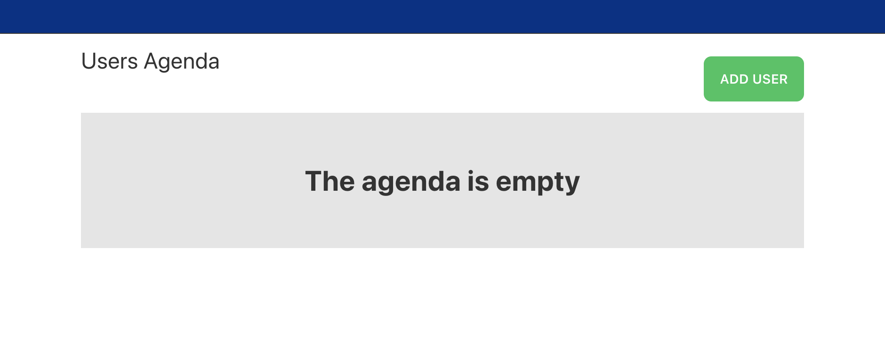
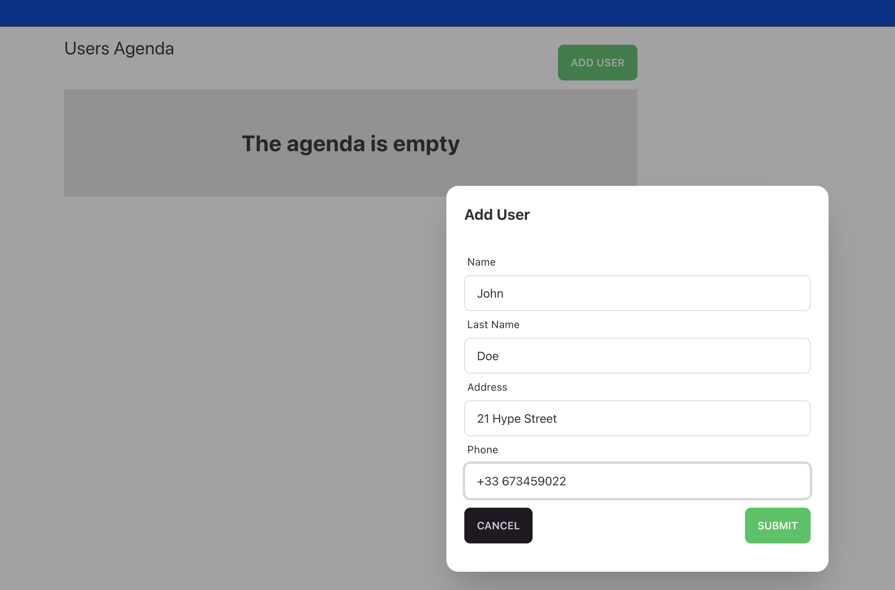
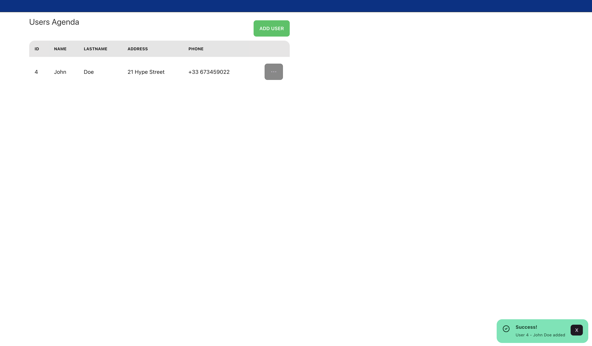
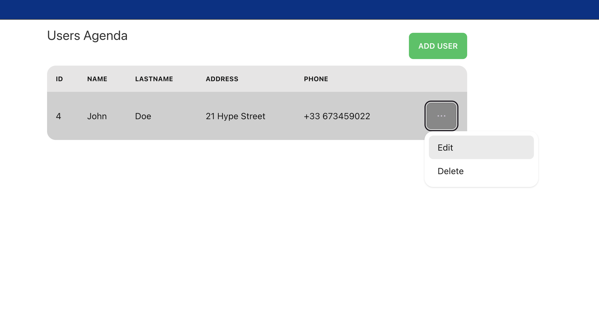

# Agenda Bundle Template

## Introduction
Welcome to the documentation for the agenda-bundle-template. This project serves as a pro-code bundle, it combines multiple components to help creators starting with new bundle.
It includes a Java Spring Boot backend and three microfrontends implemented using different frameworks: Angular, React, and Vue.js.
## The components
### The Spring boot microservice
This microservice exposes an API to manage the agenda features. You access it from the `microservices/springboot-agenda` folder.
The endpoints are secured, accordingly with the business rules, with Spring Security using annotations. 

```
@PostMapping("/contact")
@PreAuthorize("hasRole('admin')")
@SecurityRequirement(name = "agenda_auth")
public ResponseEntity<ContactRecord> createContact(@RequestBody ContactRecord contact) throws URISyntaxException {
    log.debug("REST request to create a NEW contact: {}", contact );

    ContactRecord created = contactService.save(contact);

    return ResponseEntity
            .created(new URI("/api/contacts/" + created.id()))
            .body(created);
}
```

You can access the swagger-ui to test the API from this URL: [http://localhost:8081/swagger-ui/index.html]()

### The microfrontends
All the three microfrontends provide the same user experience with a close look and feel. So, you have the choice to choose with which technology you can start your composable journey.
The microfrontends are delivered with a preconfigured API Claims to work both locally, and on the Entando platform.

```
export const mfeconfig = {
    "systemParams": {
        "api": {
            "springboot-agenda-api": {
                "url": "http://localhost:8081"
            }
        }
    }
}
```
This doesn't require you extra steps to work, but if you want to learn more about API Claims, you can check our [official tutorial](https://developer.entando.com/v7.2/tutorials/create/ms/add-api-claim.html#prerequisites).

The agenda allows you to
- access the users list:


- Add a new user:



- Edit or delete one:


## Create a bundle from the template
The purpose of this bundle is to provide users with a sample or template to kickstart their own application development.

The following documentation helps you to start using it as a template.
### Prerequisites
Before proceeding with the bundle creation process, ensure that you have the following prerequisites installed on your system:

1. Java Development Kit (JDK) - version 17
2. Node.js - version 18 or higher
3. NPM - version 9 or higher
4. Entando CLI v7.x

### Initialize Your Bundle
1. Open a terminal or command prompt.
2. Navigate to the directory where you want to create your bundle.
3. Run the following command to initialize your bundle:
```bash
ent bundle init my-bundle --from-hub --hub-url=<hub_url>
```
Replace `<hub_url>` with the URL of the hub from where you want to initialize your bundle.

Replace <mfe_name> with the name of the microfrontend you want to remove (e.g., vue-widget-agenda, angular-widget-agenda, react-widget-agenda).
Note: Be cautious when removing a microfrontend as it will permanently delete the corresponding files and configurations.

### Services included
The current bundle provides two services: Keycloack and Posgresql. Use them to create your dev environment. These are not aimed to be used in production.
Start the services before starting the components
```bash
ent bundle svc start agenda-keycloak
```
```bash
ent bundle svc start agenda-postgresql
```

### Backend Configuration and Start
1. Open the project in your preferred Java IDE or text editor.
2. Customize the backend code and configurations according to your application requirements.
3. Start the Spring Boot backend application by running the following command in a terminal or command prompt:
```bash
ent bundle run springboot-agenda
```
> Please note, the springboot-agenda microservice require both a Postgresql database, and a Keycloak to run.
> This bundle provides SVC to run them as container for development purposes
> run `ent bundle svc start agenda-postgresql` and `ent bundle svc start agenda-keycloak`

### Microfrontend Configuration and Build
1. For each microfrontend framework (Angular, React, and Vue.js):
- Open the respective microfrontend module in your preferred IDE or text editor.
- Customize the microfrontend code and configurations as per your application needs.
2. Install the project dependencies and build the microfrontends by running the following command in a terminal or command prompt:
```bash
ent bundle run <mfe-name>
```
> Replace `<mfe_name>` with the name of the microfrontend you want to run. You can find the names in the entando.json file

If you want to run all the microfrontends using one command, you use that command instead:
```bash
ent bundle run --all-mfe
```

### Optional: Remove Unwanted Microfrontends
1. Open a terminal or command prompt. 
2. Navigate to the project root directory. 
3. Run the following command to remove a specific microfrontend:
```bash
ent bundle mfe rm <mfe_name>
```

## Conclusion
Feel free to explore the code and leverage this bundle as a sample or template for your future projects.

If you need any further assistance or have any questions, please refer to the project documentation or reach out to our (https://join.slack.com/t/entandocommunity/shared_invite/zt-g609owdv-2K~YRh8zrI6lqlWo4aFWUw)[Slack Community] for help.
